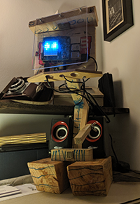

# Interactive Pet Robot (Raspberry Sense Hat)

Make your very own digital space pixel pet with your Raspberry Pi and Sense HAT. Using sensors and output devices are a great way to make your computer programs more interactive. The Raspberry Pi Sense HAT contains a whole set of sensors and opportunites.

The basic idea here is to provide the functions of a *Pet Robot* as a python API. Try one of these:
- [Blink](http://raspberrypi:8080/api/blink)
- [Look left](http://raspberrypi:8080/api/displayimage/3)
- [Say good morning in german](http://raspberrypi:8080/api/say/Guten%20Morgen)

A note on **security**: Please do this in your private network only - opening ports to the internet is not advisable.

A note on **privacy**: The speech services uses the Google text-to-speech api. Don't let it say anything private.

## Requirements

As well as a Raspberry Pi 4, the usual peripherals, and an up-to-date SD card you'll also need:

### Hardware
- Wifi
- Sense HAT
- USB-powered speakers with a 3.5mm jack
- Some scrap wood, screws etc. and creative children

### Software
- Sense HAT for Python 3
- python 3 pypng
- 8x8GridDraw / photoshop or equivalent

See [software installation](software.md)

## The worksheet

- Go to the [worksheet](worksheet.md)
- Printable [workshop worksheet](files/printable-worksheet.pdf) based on this resource

## Licence

Unless otherwise specified, everything in this repository is covered by the following licence:

***Interactive Pixel Pet*** by the [Raspberry Pi Foundation](http://www.raspberrypi.org) is licenced under a [Creative Commons Attribution 4.0 International License](http://creativecommons.org/licenses/by-sa/4.0/).

Based on a work at https://github.com/raspberrypilearning/pixel-pet
