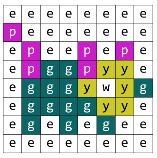

## Label each pixel of your image

- Think of a letter from the alphabet to represent each colour in your pixel pet image. e.g. `w` for white or `r` for red. 
- If you are using squared paper for your design, you can write the letters on top like this:

	
	
	Note that `e` stands for `empty`.

- If you are using the 8x8GridDraw editor then you can write out your squares on paper, representing each colour with a letter and separating them with a comma. Alternatively, you could type them into a text editor like **Leafpad** which you can find by clicking on **Menu**, **Accessories** and **Text Editor**. 
	
	You'll end up with something that looks like this:
	
	```
	e, e, e, e, e, e, e, e,
	p, e, e, e, e, e, e, e,
	e, p, e, e, p, e, p, e,
	e, p, g, g, p, y, y, e,
	e, g, g, g, y, w, y, g,
	e, g, g, g, g, y, y, e,
	e, g, e, g, e, g, e, e,
	e, e, e, e, e, e, e, e
	```
	
	You'll notice that we have eight rows and eight columns of letters, each separated by a comma, to make up the LED matrix on the Sense HAT.
	
- Repeat this step for your second pet design so that you end up with two grids of letters.

	Can you think of any problems that might arise when only using one letter to label different colours? How might you solve this problem?	

